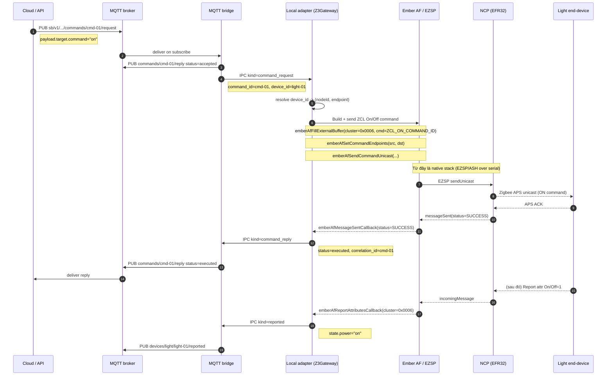
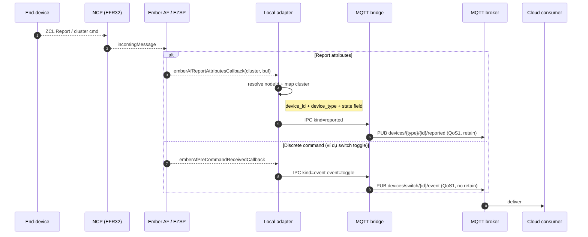

# Adapter Action Map (v1)

Tài liệu này đóng băng cách **MQTT**, **IPC**, và **adapter action** được ánh xạ với nhau
trong Phase 0. Nó là "kim chỉ nam" duy nhất cho mọi adapter mới: bạn chỉ cần đọc file này
để biết một message MQTT nào phải trở thành action gì trên Zigbee.

Xem kèm:

- [MQTT_CONTRACT.md](./MQTT_CONTRACT.md) — namespace, envelope, topic tree, QoS/retain
- [UART_FRAME_FORMAT.md](./UART_FRAME_FORMAT.md) — IPC NDJSON schema
- [DEVICE_CAPABILITY_MATRIX.md](./DEVICE_CAPABILITY_MATRIX.md) — device_type × capability

---

## 1. Ranh giới hệ thống (Freeze)

```text
+-----------+         MQTT         +-----------+       IPC NDJSON       +-----------+      Ember AF / EZSP     +--------+
|  Cloud /  | <------------------> |  MQTT     | <------------------->  |  Local    | <----------------------> |  NCP   |
|  API /    |   sb/v1/{t}/{s}/{g}  |  bridge   |   /tmp/sb-gateway.sock |  adapter  |  (ASH over serial/UART)  | radio  |
|  Mobile   |                      |           |                        |           |                          | (EFR32)|
+-----------+                      +-----------+                        +-----------+                          +--------+
```

- **MQTT bridge ↔ local adapter**: biên IPC chính thức, NDJSON trên Unix socket.
- **Local adapter ↔ NCP**: do Z3Gateway / EZSP / ASH quản, **không** phải lớp contract của repo này.
- Bất cứ luồng đi qua RF đều phải gom vào action của adapter → cuối cùng gọi
  **Ember AF / EZSP API** (ví dụ `emberAfFillExternalBuffer` + `emberAfSendCommandUnicast`).
  Đây là điểm "cuối" của code do repo này viết; mọi thứ sau đó là stack nhà cung cấp.

### Những điều **không** còn đúng (legacy)

- `@DATA` / `@CMD` / `@ACK` **không** phải biên chính thức của repo này. Đây là di sản
  từ bản plan cũ. Trong mã hiện tại, `cmd_handler.c` vẫn chấp nhận chuỗi `@CMD {...}` trên
  stdio cho mục đích debug/CLI local — không dùng cho cloud/IPC.
- UART giữa host và EFR32 **không** có application frame format do repo này định nghĩa;
  nó là EZSP/ASH thuần.

---

## 2. Ánh xạ MQTT ↔ IPC

### Bridge → adapter (chỉ 2 kind)

| MQTT topic | IPC `kind` | Ý nghĩa |
| --- | --- | --- |
| `devices/{type}/{id}/desired` | `desired` | Cloud muốn trạng thái mong muốn cho device |
| `commands/{command_id}/request` | `command_request` | Cloud ra một lệnh rời rạc (có `command_id`, `correlation_id`) |

### Adapter → bridge (chỉ 3 kind)

| IPC `kind` | MQTT topic | Ý nghĩa |
| --- | --- | --- |
| `reported` | `devices/{type}/{id}/reported` | Trạng thái hiện tại của device |
| `event` | `devices/{type}/{id}/event` | Sự kiện rời rạc (ví dụ `switch` toggle) |
| `command_reply` | `commands/{command_id}/reply` | Kết quả cuối của một command_request |

### Deferred (không thuộc v1)

OTA và registry/health/log vẫn tồn tại trong topic tree và IPC schema, nhưng **không**
thuộc Phase 0 freeze. Adapter v1 **không bắt buộc** hỗ trợ các kind sau:
`registry`, `gateway_health`, `gateway_log`, `ota_progress`, `ota_event`,
`ota_manifest`, `ota_desired`.

---

## 3. Ánh xạ IPC ↔ adapter action

Bảng dưới là *duy nhất* nguồn sự thật về việc adapter phải làm gì khi nhận một IPC record.

### 3.1 Bridge → adapter

| IPC `kind` | device_type | Payload đầu vào (tóm tắt) | Adapter action | Kết thúc ở |
| --- | --- | --- | --- | --- |
| `command_request` | `light` | `op=device.command`, `target.command ∈ {on, off, set_level}` | `light_on()` / `light_off()` / `light_set_level(level)` | Ember AF: On/Off 0x0006 (`ZCL_ON_COMMAND_ID`, `ZCL_OFF_COMMAND_ID`) hoặc Level Control 0x0008 (`MoveToLevel`) |
| `command_request` | `switch` | — | **Reject** với `command_reply.status=failed`, `reason="unsupported"` | — |
| `command_request` | `motion` | — | **Reject** với `command_reply.status=failed`, `reason="unsupported"` | — |
| `desired` | `light` | `desired.power`, `desired.level` | Nội suy: `power` → on/off, `level` → set_level; gom lại tối thiểu số TX | Ember AF (như trên) |
| `desired` | `switch` / `motion` | — | Ignore; có thể log warning | — |

### 3.2 Adapter → bridge

| Nguồn (native) | IPC `kind` | Payload chính | MQTT topic ra |
| --- | --- | --- | --- |
| Report attribute 0x0006 (On/Off) | `reported` | `state.power`, `state.reachable` | `devices/light/{id}/reported` |
| Report attribute 0x0008 (Level) | `reported` | `state.level` | `devices/light/{id}/reported` |
| Report attribute 0x0406 (Occupancy) | `reported` | `state.occupancy` | `devices/motion/{id}/reported` |
| Report attribute 0x0001 (Battery) | `reported` | `state.battery` | `devices/light\|motion\|switch/{id}/reported` (nếu device hỗ trợ) |
| Nhận cluster-specific cmd từ switch (client-side On/Off) | `event` | `event: "toggle"` | `devices/switch/{id}/event` |
| `emberAfMessageSentCallback` với `status=SUCCESS` cho một `command_request` | `command_reply` | `status=executed` | `commands/{command_id}/reply` |
| `emberAfMessageSentCallback` với `status≠SUCCESS` | `command_reply` | `status=failed`, `reason=...` | `commands/{command_id}/reply` |
| Hết timeout chờ TX confirm | `command_reply` | `status=timeout` | `commands/{command_id}/reply` |
| Gateway accept/queue/send chặng trung gian | `command_reply` | `status ∈ {accepted, queued, sent}` | `commands/{command_id}/reply` |

> Các status `accepted/queued/sent` do **MQTT bridge** phát (nó biết message đã đi qua chặng nào);
> `executed/failed/timeout` do **adapter** phát (nó biết kết quả RF).

---

## 4. Light command path — end-to-end

Đây là "con đường vàng" cho một lệnh bật đèn từ cloud xuống Zigbee RF.



**Các điểm cố định (frozen):**

- `command_id` = khóa `correlation_id` xuyên suốt; bridge không đổi nó.
- Biên cuối của code repo là `emberAfSendCommandUnicast(...)`.
- `command_reply` cho cùng `command_id` được phát nhiều lần theo lifecycle:
  `accepted → queued → sent → executed | failed | timeout`. Xem MQTT_CONTRACT.md §"Vòng đời lệnh".

---

## 5. Reported / event uplink



**Các điểm cố định (frozen):**

- Adapter chỉ publish `reported` với các required state theo
  [DEVICE_CAPABILITY_MATRIX.md](./DEVICE_CAPABILITY_MATRIX.md).
- `reported` luôn retain; `event` không retain.
- `switch` chỉ sinh `event` (không bao giờ là `command_request` đích).

---

## 6. Danh sách adapter action chuẩn v1

| Action ID | device_type | Tham số | Native boundary |
| --- | --- | --- | --- |
| `light_on` | `light` | (none) | On/Off (0x0006) `On` |
| `light_off` | `light` | (none) | On/Off (0x0006) `Off` |
| `light_set_level` | `light` | `level: 0..254`, `transition_ms?` | Level Control (0x0008) `MoveToLevelWithOnOff` |
| `resolve_target` | * | `device_id` | Tra `device_id → (nodeId, endpoint)` từ registry local |
| `emit_reported` | * | `device_id`, `state` | Ghi ra IPC `kind=reported` |
| `emit_event` | * | `device_id`, `event` | Ghi ra IPC `kind=event` |
| `emit_command_reply` | * | `command_id`, `status`, `reason?` | Ghi ra IPC `kind=command_reply` |

> Tên hàm native cụ thể (ví dụ `emberAfFillExternalBuffer`,
> `emberAfSendCommandUnicast`, `emberAfReadAttribute`) là **convention của Silabs SDK**,
> không phải do repo này định nghĩa. Adapter thực thi v1 sẽ gọi qua wrapper riêng
> để dễ test/mock.

---

## 7. Quy tắc bất di bất dịch cho Phase 0

1. Adapter **không** được xuất hiện IPC kind nào ngoài 3 kind uplink chính thức
   (`reported`, `event`, `command_reply`) trong v1.
2. Bridge **không** được xuất hiện IPC kind nào ngoài 2 kind downlink chính thức
   (`desired`, `command_request`) trong v1.
3. Mọi `command_id` phải được echo trong `correlation_id` của mọi reply.
4. `device_type` đối ngoại là `light`, `switch`, `motion` — không dùng `occupancy`.
5. Biên cuối của code repo là một gọi Ember AF / EZSP; không có "custom UART frame"
   giữa adapter và NCP.
