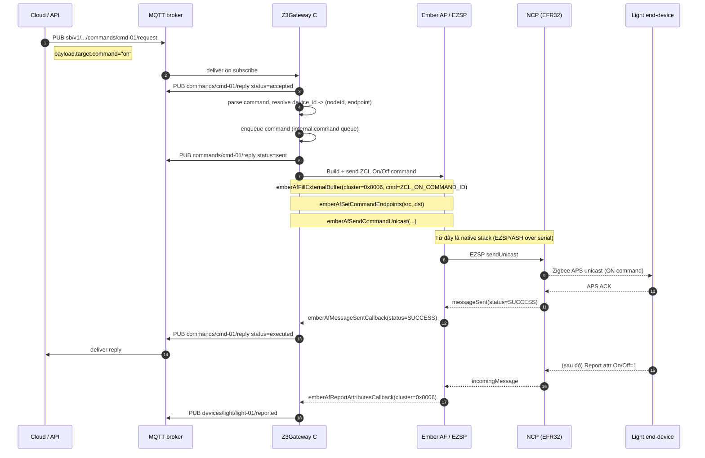
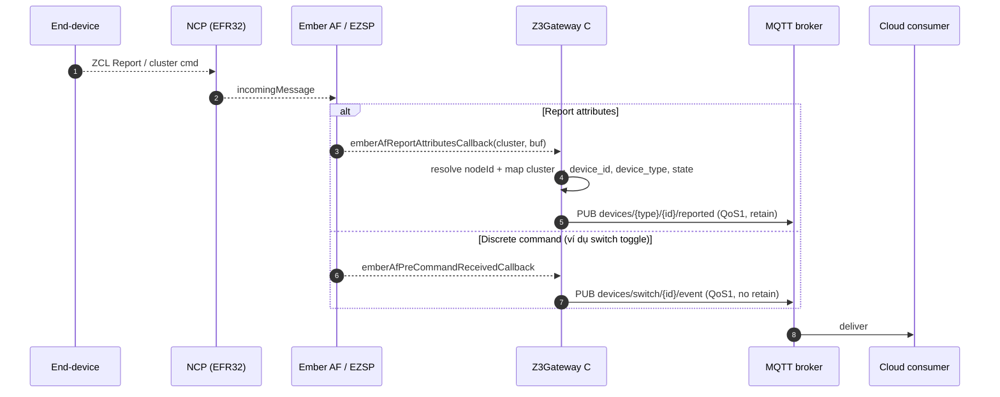

# Gateway Action Map (v1)

Tài liệu này đóng băng cách **MQTT** và **Z3Gateway C action** được ánh xạ với nhau
trong Phase 0. Đây là "kim chỉ nam" duy nhất cho mọi action mới: bạn chỉ cần đọc file này
để biết một message MQTT nào phải trở thành action gì trên Zigbee.

Xem kèm:

- [MQTT_CONTRACT.md](./MQTT_CONTRACT.md) — namespace, envelope, topic tree, QoS/retain
- [UART_FRAME_FORMAT.md](./UART_FRAME_FORMAT.md) — production architecture, native boundary
- [DEVICE_CAPABILITY_MATRIX.md](./DEVICE_CAPABILITY_MATRIX.md) — device_type × capability

---

## 1. Ranh giới hệ thống (Frozen)

```text
+-----------+         MQTT         +-------------------+      Ember AF / EZSP     +--------+
|  Cloud /  | <------------------> |    Z3Gateway C    | <----------------------> |  NCP   |
|  API /    |   sb/v1/{t}/{s}/{g}  |  (single process) |  (ASH over serial/UART)  | radio  |
|  Mobile   |                      |  • MQTT client    |                          | (EFR32)|
+-----------+                      |  • command mgmt   |                          +--------+
                                   |  • rule engine    |
                                   |  • device registry|
                                   +-------------------+
```

- **MQTT broker ↔ Z3Gateway C**: biên chính thức duy nhất, dùng MQTT protocol.
- **Z3Gateway C ↔ NCP**: do Z3Gateway / EZSP / ASH quản, **không** phải lớp contract của repo này.
- Bất cứ luồng đi qua RF đều gom vào action bên trong Z3Gateway C → cuối cùng gọi
  **Ember AF / EZSP API** (ví dụ `emberAfFillExternalBuffer` + `emberAfSendCommandUnicast`).
  Đây là điểm "cuối" của code do repo này viết; mọi thứ sau đó là stack nhà cung cấp.

### Những điều **không** còn đúng (legacy)

- `@DATA` / `@CMD` / `@ACK` **không** phải biên chính thức của repo này. Đây là di sản
  từ bản plan cũ. Trong mã hiện tại, `cmd_handler.c` vẫn chấp nhận chuỗi `@CMD {...}` trên
  stdio cho mục đích debug/CLI local — không dùng cho production.
- UART giữa host và EFR32 **không** có application frame format do repo này định nghĩa;
  nó là EZSP/ASH thuần.
- **IPC Unix socket + NDJSON** giữa "adapter" và "bridge" là kiến trúc cũ, đã bị thay thế
  bởi direct MQTT integration trong Z3Gateway C. Xem git history nếu cần tham khảo.

---

## 2. Ánh xạ MQTT ↔ Z3Gateway C action

### MQTT → Z3Gateway C (downlink — nhận từ cloud)

| MQTT topic | Xử lý trong Z3Gateway C | Ý nghĩa |
| --- | --- | --- |
| `commands/{command_id}/request` | `sb_command_handle_request()` | Cloud ra một lệnh rời rạc (có `command_id`, `correlation_id`) |
| `devices/{type}/{id}/desired` | `device_dispatch_desired()` | Cloud muốn trạng thái mong muốn cho device |

### Z3Gateway C → MQTT (uplink — publish lên broker)

| Nguồn bên trong | MQTT topic | Ý nghĩa |
| --- | --- | --- |
| Attribute report callback | `devices/{type}/{id}/reported` | Trạng thái hiện tại của device |
| Discrete event (switch toggle, etc.) | `devices/{type}/{id}/event` | Sự kiện rời rạc |
| Command result | `commands/{command_id}/reply` | Kết quả / lifecycle update của một command |

### Deferred (không thuộc v1)

OTA và registry/health/log vẫn tồn tại trong topic tree, nhưng **không**
thuộc Phase 0 freeze. Z3Gateway v1 **không bắt buộc** hỗ trợ:
`registry`, `gateway_health`, `gateway_log`, `ota_progress`, `ota_event`,
`ota_manifest`, `ota_desired`.

---

## 3. Ánh xạ MQTT → adapter action (chi tiết)

Bảng dưới là *duy nhất* nguồn sự thật về việc Z3Gateway C phải làm gì khi nhận một MQTT message.

### 3.1 Downlink (MQTT → Zigbee)

| MQTT source | device_type | Payload đầu vào (tóm tắt) | Z3Gateway C action | Native boundary |
| --- | --- | --- | --- | --- |
| `commands/.../request` | `light` | `op=device.command`, `target.command ∈ {on, off, set_level}` | `light_on()` / `light_off()` / `light_set_level(level)` | Ember AF: On/Off 0x0006 (`ZCL_ON_COMMAND_ID`, `ZCL_OFF_COMMAND_ID`) hoặc Level Control 0x0008 (`MoveToLevel`) |
| `commands/.../request` | `switch` | — | **Reject** với reply `status=failed`, `reason="unsupported"` | — |
| `commands/.../request` | `motion` | — | **Reject** với reply `status=failed`, `reason="unsupported"` | — |
| `devices/.../desired` | `light` | `desired.power`, `desired.level` | Nội suy: `power` → on/off, `level` → set_level; gom lại tối thiểu số TX | Ember AF (như trên) |
| `devices/.../desired` | `switch` / `motion` | — | Ignore; có thể log warning | — |

### 3.2 Uplink (Zigbee → MQTT)

| Nguồn (native callback) | MQTT topic ra | Payload chính |
| --- | --- | --- |
| Report attribute 0x0006 (On/Off) | `devices/light/{id}/reported` | `state.power`, `state.reachable` |
| Report attribute 0x0008 (Level) | `devices/light/{id}/reported` | `state.level` |
| Report attribute 0x0406 (Occupancy) | `devices/motion/{id}/reported` | `state.occupancy` |
| Report attribute 0x0001 (Battery) | `devices/{type}/{id}/reported` | `state.battery` (nếu device hỗ trợ) |
| Nhận cluster-specific cmd từ switch (client-side On/Off) | `devices/switch/{id}/event` | `event: "toggle"` |
| `emberAfMessageSentCallback` với `status=SUCCESS` cho một command | `commands/{command_id}/reply` | `status=executed` |
| `emberAfMessageSentCallback` với `status≠SUCCESS` | `commands/{command_id}/reply` | `status=failed`, `reason=...` |
| Hết timeout chờ TX confirm | `commands/{command_id}/reply` | `status=timeout` |
| Command accepted / queued / sent (internal lifecycle) | `commands/{command_id}/reply` | `status ∈ {accepted, queued, sent}` |

> Toàn bộ command lifecycle (`accepted → queued → sent → executed | failed | timeout`)
> do **Z3Gateway C** quản lý và publish trực tiếp. Không có process trung gian.

---

## 4. Light command path — end-to-end

Đây là "con đường vàng" cho một lệnh bật đèn từ cloud xuống Zigbee RF.



**Các điểm cố định (frozen):**

- `command_id` = khóa `correlation_id` xuyên suốt.
- Biên cuối của code repo là `emberAfSendCommandUnicast(...)`.
- `command_reply` cho cùng `command_id` được phát nhiều lần theo lifecycle:
  `accepted → queued → sent → executed | failed | timeout`. Xem MQTT_CONTRACT.md §"Vòng đời lệnh".

---

## 5. Reported / event uplink



**Các điểm cố định (frozen):**

- Z3Gateway C chỉ publish `reported` với các required state theo
  [DEVICE_CAPABILITY_MATRIX.md](./DEVICE_CAPABILITY_MATRIX.md).
- `reported` luôn retain; `event` không retain.
- `switch` chỉ sinh `event` (không bao giờ là `command_request` đích).

---

## 6. Danh sách Z3Gateway C action chuẩn v1

| Action ID | device_type | Tham số | Native boundary |
| --- | --- | --- | --- |
| `light_on` | `light` | (none) | On/Off (0x0006) `On` |
| `light_off` | `light` | (none) | On/Off (0x0006) `Off` |
| `light_set_level` | `light` | `level: 0..254`, `transition_ms?` | Level Control (0x0008) `MoveToLevelWithOnOff` |
| `resolve_target` | * | `device_id` | Tra `device_id → (nodeId, endpoint)` từ device registry |
| `emit_reported` | * | `device_id`, `state` | Build MQTT envelope → publish `devices/{type}/{id}/reported` |
| `emit_event` | * | `device_id`, `event` | Build MQTT envelope → publish `devices/{type}/{id}/event` |
| `emit_command_reply` | * | `command_id`, `status`, `reason?` | Build MQTT envelope → publish `commands/{command_id}/reply` |

> Tên hàm native cụ thể (ví dụ `emberAfFillExternalBuffer`,
> `emberAfSendCommandUnicast`, `emberAfReadAttribute`) là **convention của Silabs SDK**,
> không phải do repo này định nghĩa.

---

## 7. Quy tắc bất di bất dịch cho Phase 0

1. Z3Gateway C **chỉ** publish lên MQTT 3 loại uplink chính thức: `reported`, `event`, `command_reply`.
2. Z3Gateway C **chỉ** subscribe 2 loại downlink chính thức: `desired`, `command_request`.
3. Mọi `command_id` phải được echo trong `correlation_id` của mọi reply.
4. `device_type` đối ngoại là `light`, `switch`, `motion` — không dùng `occupancy`.
5. Biên cuối của code repo là một gọi Ember AF / EZSP; không có "custom UART frame"
   giữa Z3Gateway C và NCP.
6. **Không còn IPC socket hay NDJSON** — mọi giao tiếp với bên ngoài đều qua MQTT trực tiếp.
